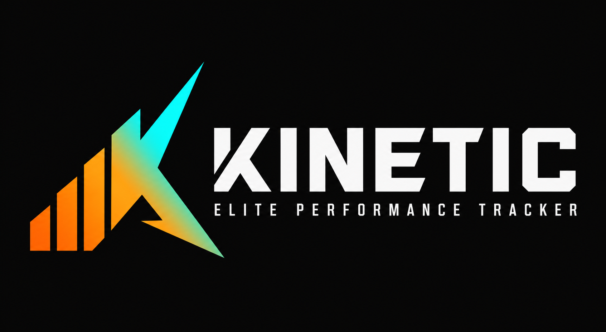
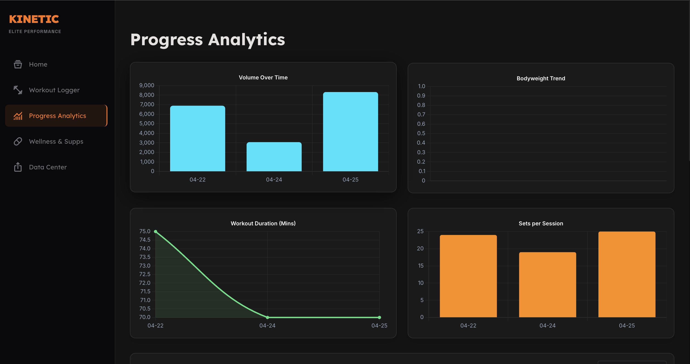
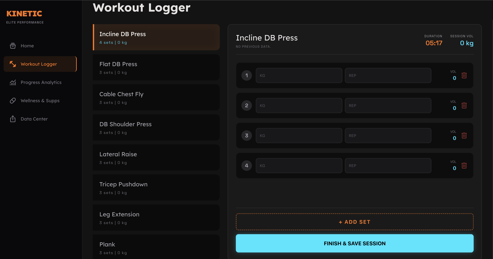
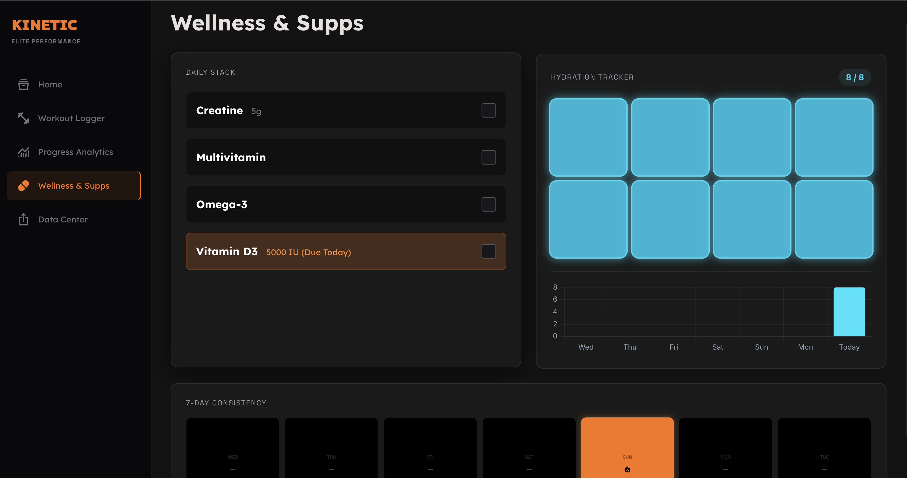

<div align="center">
  
  <h1>Kinetic Peak Performance</h1>
  <p><strong>A beautifully designed, mobile-first Web App for tracking workouts, volume progression, and daily supplements.</strong></p>
</div>

---

## ⚡ Overview
Kinetic is a completely serverless, zero-dependency workout companion built for seamless cross-device synchronization via Google Sheets. Designed with a premium, sleek UI, Kinetic allows you to track sets, reps, weight, hydration, and supplements all in one place without ever needing to log into a bulky third-party platform.

## ✨ Features

- **Live Session Logger:** Track your exercises with a dynamic set/rep interface and a built-in interactive rest timer.
- **Performance Analytics:** Visualize your progression with gorgeous charts showing Lifetime Volume, Last Session Volume, and Volume Split ratios.
- **Fuel & Hydration:** Maintain streaks for your Daily Stack (Creatine, Multivitamin, Omega-3, and Vitamin D3) and track your daily water intake.
- **100% Private Cloud Sync:** Your data belongs to you. Kinetic uses an encrypted Webhook to push/pull your JSON data directly to your personal Google Sheet. No accounts, no subscriptions.
- **Mobile PWA Support:** Install Kinetic directly to your iPhone or Android Home Screen for a native, full-screen app experience.

---

## 📸 Screenshots

### 1. The Dashboard & Analytics
Track your mass trends, volume PRs, and monthly progressions through an intuitive, data-dense dashboard.



### 2. Live Workout Logger
Focus on your lift. The streamlined logger handles the math, calculates your volume per exercise, and manages your rest periods.



### 3. Fuel & Hydration
Don't let your supplements slide. Track your daily intakes and watch your streaks build.



---

## 🚀 Setup & Deployment

1. **Clone the repo:**
   ```bash
   git clone https://github.com/mahmoudnagatyy/gym-tracker-v1.git
   ```
2. **Open `index.html`:** The entire application runs natively in the browser. No build steps required.
3. **Connect your Cloud:** Go to the **Data Center** tab in the app and paste your Google Apps Script Webhook URL to enable Cross-Device Sync.

---
<div align="center">
  <i>"Discipline weighs ounces. Regret weighs tons."</i>
</div>
